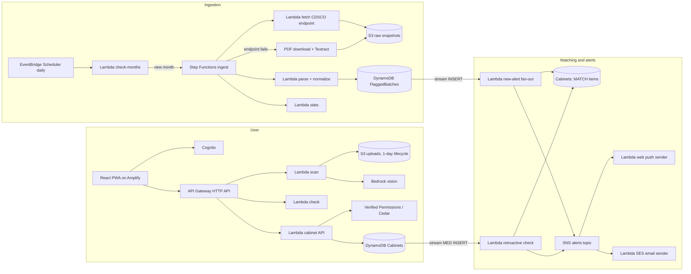
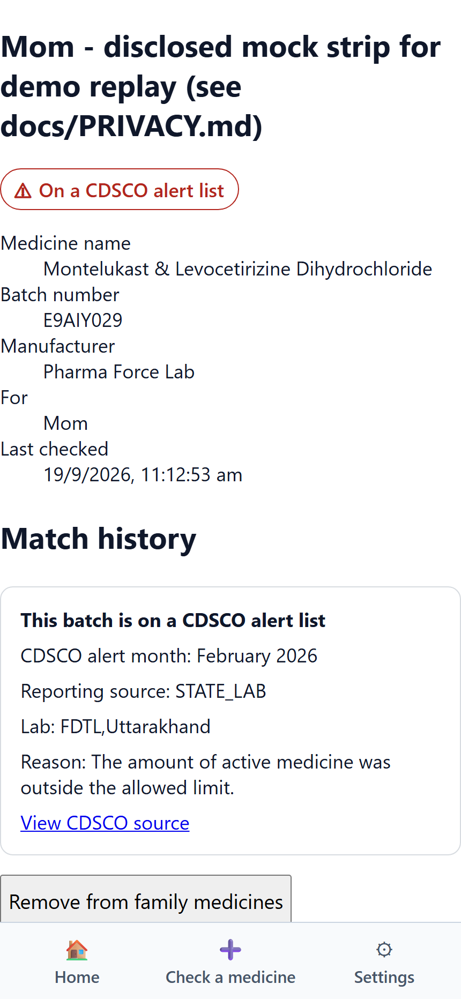
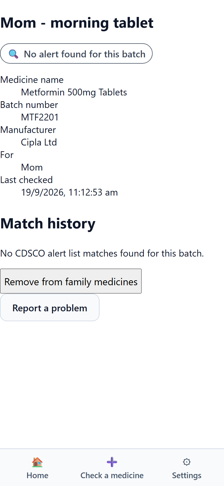
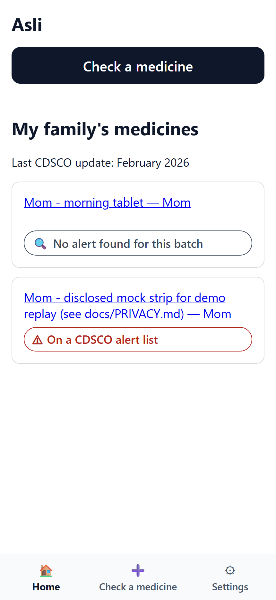

# Asli - Is this medicine batch flagged by CDSCO?

> Built for WeMakeDevs × AWS "First Commit" (Ship It track), by team bskry.

## Try it (no sign-up)
**Live app:** https://main.d2ag2oukltn4mc.amplifyapp.com · **Demo video:** {{YOUTUBE_URL}}

- **Judges: open the live app and press "Continue as guest"** (guest mode) on the first screen. It
  signs you in to a sample family's cabinet ("Mom's medicines", sample data only) with no account and no
  typing.
- The public pages need no sign-in either: use the links under "Open to anyone" on the same screen
  (CDSCO alert counts, and Asli's measured accuracy and cost).
- If the button ever fails, the same account works by hand: `asha.demo@asli.internal` /
  `AsliDemo!2026`.
- Once in, to see a FLAGGED result, choose *Check a medicine → Type details* and enter product
  `Montelukast & Levocetirizine`, batch `E9AIY029`, manufacturer `Pharma Force Lab` (a real row from
  CDSCO's Feb-2026 list). Any other batch gives "No alert found for this batch".

The long-form answers are in `submission/WRITEUP.md`; the video plan is `submission/DEMO_SCRIPT.md`.

## The problem
India's Central Drugs Standard Control Organisation (CDSCO) publishes monthly lists of drug
batches that failed quality tests (Not of Standard Quality) or were found Spurious. Families
almost never see them - the lists are published as government tables and PDFs, not pushed to
anyone who actually owns the medicine.

In a hand check of 171 flagged batches from three CDSCO central-lab alerts (Sep 2024, Jan 2025,
Mar 2025), **170 (99.4%) were still within their expiry date when announced**, with an average of
about 9.6 months between manufacture and announcement - meaning the batch was very likely still
sitting in a medicine cabinet by the time CDSCO published the alert.

We confirmed this against a full real ingestion run on `int` (2026-09-19, 21 months of CDSCO
data, `2024-11` to `2026-07`):

| | Value |
|---|---|
| Total flagged batches ingested | 3,326 (3,274 NSQ + 52 Spurious) |
| Within expiry at announcement | 3,204 (99.47%) |
| Avg months from manufacture to alert | 10.7 (median 9) |
| By reporting source | Central lab 1,072 · State lab 2,249 · Unknown 5 |

See `docs/PRODUCT.md` "Evidence" for the full reconciliation between the hand-verified spot check
and the live numbers.

## What Asli does
- Scan a strip, a pharmacy bill, or a pack QR code, or type the details in
- Match the batch against every official CDSCO NSQ and Spurious list, deterministically, with a
  link back to the original CDSCO source
- Save a family's medicines in a shared cabinet, checked against the whole CDSCO history, and
  re-checked automatically every time a new list is published
- Alert every caregiver in the cabinet by web push and email when a new CDSCO list matches
- Explain what to do next in plain language (English, Hindi, Kannada, with read-aloud) - never
  "safe", always "this batch", always cite the source, and never advise stopping a prescribed
  medicine without a doctor
- Bulk-check a pharmacy's stock from a CSV (pharmacy mode) and route problem reports to India's
  official PvPI pharmacovigilance channel instead of broadcasting user reports to other users

## Architecture

Matching is fully deterministic - `packages/matching` decides the tier (FLAGGED / VERIFY /
NO_ALERT_FOUND). No LLM ever decides or influences a tier; Bedrock is only used to extract fields
from a photo, never to judge safety. See `docs/ARCHITECTURE.md` for the full service-choice
rationale and `docs/MATCHING.md` for the tier rules.

Exported image (GitHub renders the mermaid block above natively, but here's a static PNG too):
`docs/diagrams/architecture.png` (source: `docs/diagrams/architecture.mmd`, rendered with
`npx @mermaid-js/mermaid-cli`).

## Screenshots
Captured live against the deployed PWA at **https://main.d2ag2oukltn4mc.amplifyapp.com**, signed
in as the seeded demo user - real data, not mocked. These are the screens that carry the most
weight in `submission/DEMO_SCRIPT.md`:

1. **Flagged result card** (0:55–1:25 in the script) - the red "On a CDSCO alert list" card with
   the CDSCO alert month, reporting lab, reason, and source link, showing "this batch" wording,
   not a brand or manufacturer callout.

   

2. **"No alert found" result card** (0:30–0:55) - the neutral result, to show it never says "safe".

   

3. **Home screen: family's medicines** (1:45–2:35) - both the clean and flagged medicine saved to
   "Mom's medicines", matching the real seeded demo data used for `submission/DEMO_SCRIPT.md`, with
   the last CDSCO update month shown. The full "second phone/caregiver alert arriving" moment is
   best shown live in the video rather than a static screenshot.

   

## Repository layout
```
apps/web                 React + Vite PWA
packages/contracts       Zod schemas, types, fixtures (source of truth)
packages/matching        Deterministic matching library
packages/content         Reviewed guidance templates (en, hi, kn), reason codes
packages/authz           Verified Permissions client and Cedar schema/policies
services/*               Lambda handlers, one folder per lane
infra                    AWS CDK app (shared stack + one stack per lane)
tools/accuracy           Accuracy harness
testset                  Labelled strip and bill photos (no personal data)
docs, plan, submission   Specs, build plan, submission material
```

## Status
All engineering lanes (ingestion, matching, scan/check API, cabinet sharing, alerts, permissions,
content/i18n, dashboard, QR, PvPI reporting, insights, pharmacy mode, hardening) are merged to
`main` and deployed to the shared `int` stage, verified against real AWS infrastructure - not just
unit tests. The one open engineering gap is account-wide: Bedrock, Textract bulk-PDF analysis,
Translate and Verified Permissions are blocked in this AWS account behind a `ValidationException` /
`SubscriptionRequiredException` unrelated to IAM. So PDF fallback ingestion, Cedar authorization
(a stub enforces the same role table) and Polly hi/kn read-aloud (the browser's `speechSynthesis`
is used) are code-complete and fixture-tested but not verified against live calls. Photo scanning
is live: the reader is the Gemini API, switchable to Bedrock by one SSM parameter. See
`plan/INTEGRATION_LOG.md` for the full, evidence-backed lane-by-lane status.

## Measured cost and accuracy
- **Accuracy (real run against the deployed stage, on `/dashboard`):** 44/44 seeded tier checks
  correct; strip batch number exact 80.0% (12 of 15), manufacturer identified strongly 86.7%,
  expiry month exact 40.0%; bill line recall 50.0% (6 bills); ~5.7 s average scan latency. A small
  sample: 15 strips and 6 bills against a target of 30 and 10.
- **Cost:** the AWS pricing table (`packages/contracts/src/pricing.ts`) is filled in for
  `ap-south-1` (all 13 tracked SKUs except `bedrockOutputTokenPer1k`, which has no SKU in any
  region - no Anthropic Bedrock model is priced in `ap-south-1` at all, so a production vision
  Lambda would need a cross-region inference profile). Per-scan cost isn't yet computable from
  real traffic, since no live scan has hit `int` in the trailing CloudWatch window (same Bedrock
  restriction). `GET /v1/public/metrics` (the `/dashboard` page) shows the real ingestion, alert
  fan-out and CDSCO-check cost figures that *are* measurable today.
- **Latency:** retroactive check (add medicine → CDSCO match → alert fan-out) verified end-to-end
  on real `int` data in well under 10 seconds. Pharmacy bulk-check verified at 3.0–3.4s warm for a
  200-row CSV.

## Deploy
```
pnpm install
pnpm -r build
STAGE=int pnpm --filter infra cdk deploy --all
```

## AI tools used
- **Claude Code (Anthropic)** - used during the coding process, alongside work we did by hand. We
  ran it one session per area from the written specs in `docs/` and `plan/`. Commits made with its
  help carry a `Co-Authored-By: Claude` trailer, so the extent of its use is visible in the git
  history (`git log --grep 'Co-Authored-By: Claude'`).
- **Gemini API (Google)** - used at runtime as the vision API that reads a strip or bill photo into
  fields (batch, manufacturer, expiry). It never decides a match: `packages/matching` alone decides
  the tier. The provider is switchable to Bedrock by one SSM parameter.

The full disclosure is in `submission/WRITEUP.md`. `submission/LEARNING_LOG.md` records what broke
and what we measured along the way.

## Licence
MIT - see [`LICENSE`](./LICENSE). Copyright holder is `bskry`.

## Credits / team
Team **bskry**: four people, two shared laptops for almost the whole build and one more near the end
(so git author names are laptops, not people). One owner per area:
- **Bhaskar Kumar Arya** - backend and the data pipeline (ingestion, matching, the API Lambdas)
- **Pushya Jain** - frontend (the React PWA)
- **Heet Shah** - design and product content (visual system, UX, wording, guidance templates)
- **Yashas Yogindra** - architecture, AWS infrastructure and delivery (CDK, deploys, cost, submission)

See `submission/WRITEUP.md` ("Who did what") for the detail.

## Running a lane

Each lane = one Claude Code session working in its own git worktree and branch.

1. Create the worktree from the repo root:
   ```
   scripts/new-worktree.sh <ID>          # e.g. scripts/new-worktree.sh A1
   ```
   This creates `../asli-<ID>` on branch `lane/<ID>`.
2. Start Claude Code in that folder with:
   > Read CLAUDE.md, then plan/tasks/<ID>-*.md, then the docs it lists. Do the task. Update the Handoff section before you stop.
3. Install and build once inside the worktree:
   ```
   pnpm install
   pnpm -r build && pnpm -r test
   ```
4. To add infrastructure, drop one file into `infra/lib/lanes/<id>.ts` exporting `register(app, stage)` - see `infra/lib/lanes/README.md`. Nobody else edits `infra/bin/app.ts`.
5. Deploy your own stack, importing shared resources from `SHARED_STAGE` (default `dev-shared`):
   ```
   STAGE=dev-<id> pnpm --filter infra cdk deploy --all
   ```
   Never deploy to `int` unless your task is T02, X, or Z1.
6. Before ending a session: `pnpm -r lint && pnpm -r test`, then update the Handoff section at the bottom of your task file and append anything learned to `submission/LEARNING_LOG.md`.

See `plan/BUILD_PLAN.md` for lane dependencies and `plan/INTEGRATION_LOG.md` for current status.
