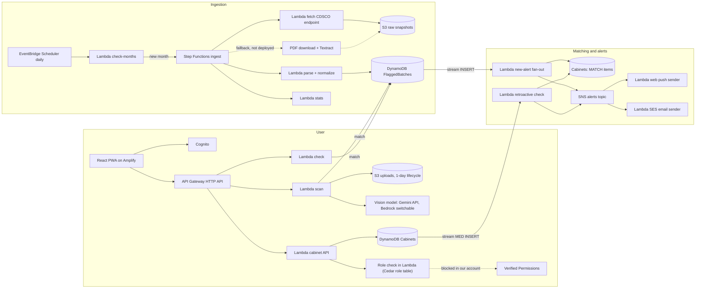

# Asli - Know your batch

Asli checks whether a medicine your family owns belongs to a batch that India's drug regulator, the
Central Drugs Standard Control Organisation (CDSCO), has declared Not of Standard Quality or Spurious.
Scan a strip, a pharmacy bill or a QR code, keep the family's medicines in one shared cabinet, and get
alerted when a new CDSCO list matches.

Built for the WeMakeDevs × AWS "First Commit" hackathon (Ship It track) by team bskry.

**Live app:** https://main.d2ag2oukltn4mc.amplifyapp.com · **Demo video:** {{YOUTUBE_URL}} · **Write-up:** [`submission/WRITEUP.md`](submission/WRITEUP.md)

## Try the live app (no sign-up)
- Open the live app and press **Continue as guest** on the first screen. It signs you in to a sample
  family's cabinet ("Mom's medicines", sample data only), with no account and no typing.
- The public pages need no sign-in: use the links under "Open to anyone" on the same screen (CDSCO
  alert counts by month and reason, and Asli's measured accuracy and cost).
- If the button ever fails, the same account works by hand: `asha.demo@asli.internal` / `AsliDemo!2026`.
- Once in, to see a flagged result, choose *Check a medicine → Type details* and enter product
  `Montelukast & Levocetirizine`, batch `E9AIY029`, manufacturer `Pharma Force Lab` (a real row from
  CDSCO's February 2026 list). Any other batch gives "No alert found for this batch".

## The problem
CDSCO publishes monthly lists of drug batches that failed quality tests (Not of Standard Quality) or
were found Spurious. Families almost never see them: the lists are published as government tables and
PDFs, not pushed to anyone who actually owns the medicine.

In a hand check of 171 flagged batches from three CDSCO central-lab alerts (Sep 2024, Jan 2025,
Mar 2025), **170 (99.4%) were still within their expiry date when announced**, with an average of
about 9.6 months between manufacture and announcement. The batch was very likely still in a medicine
cabinet when CDSCO published the alert.

A full ingestion run over 21 months of CDSCO data (November 2024 to July 2026) confirmed it:

| | Value |
|---|---|
| Total flagged batches ingested | 3,326 (3,274 NSQ + 52 Spurious) |
| Within expiry at announcement | 3,204 (99.47%) |
| Average months from manufacture to alert | 10.7 (median 9) |
| By reporting source | Central lab 1,072 · State lab 2,249 · Unknown 5 |

See [`docs/PRODUCT.md`](docs/PRODUCT.md) ("Evidence") for how the hand check and the full run reconcile.

## What Asli does
- **Check a medicine** from a strip photo, a pharmacy bill photo or a pack QR code, or by typing the
  details in.
- **Match deterministically** against every official CDSCO NSQ and Spurious list. The result is
  FLAGGED, VERIFY, or "No alert found for this batch", with the alert month, the reporting lab, a link
  to the original CDSCO source and our stored snapshot of it.
- **Save to a shared family cabinet.** Each saved medicine is checked against the whole CDSCO history
  and re-checked whenever a new list is published.
- **Alert every caregiver** in the cabinet by web push and email when a list matches.
- **Guide without overreaching.** Next-step guidance comes only from reviewed templates in English,
  Hindi and Kannada, with read-aloud. It always says this batch, never "safe", and never advises
  stopping a prescribed medicine without a doctor.
- **Pharmacy mode** bulk-checks stock from a CSV. Problem reports go to India's official PvPI
  pharmacovigilance channel rather than to other users.

## How it works
Matching is fully deterministic: [`packages/matching`](packages/matching) alone decides the tier
(FLAGGED / VERIFY / NO_ALERT_FOUND). No language model ever decides or influences a tier. A model is
only used to read fields off a photo, so a misread costs a wrong lookup, never a wrong verdict. See
[`docs/MATCHING.md`](docs/MATCHING.md) for the tier rules.

### Architecture

Solid arrows are deployed and running. Dotted arrows are written but not live in our AWS account (see
[Limitations](#limitations)). A static copy of the diagram is in
[`docs/diagrams/architecture.png`](docs/diagrams/architecture.png), and
[`docs/ARCHITECTURE.md`](docs/ARCHITECTURE.md) lists each service choice with the alternative rejected, more information in the above .md file.


### Request flows
1. **Check by photo.** The app asks the API for an upload target and sends the photo straight to S3
   (bill images are deleted right after extraction). The scan Lambda reads the batch, manufacturer and
   dates with a vision model and matches them against the flagged batches. The user confirms or
   corrects the fields on screen. A flagged result cites the alert month, the reporting lab, the
   original CDSCO link and our stored S3 snapshot.
2. **Check by typing or QR code.** The app calls the check Lambda, which runs the same matching and
   returns the same kind of result.
3. **Save a medicine.** The cabinet Lambda checks the caller's role, then writes the medicine to the
   Cabinets table. That write triggers a DynamoDB Stream. The retroactive Lambda checks the whole
   CDSCO history for that batch, records a MATCH item and publishes to SNS, which sends web push and
   email to the cabinet's members who have alerts on.
4. **A new CDSCO list is published.** EventBridge runs a daily check for a new month. Step Functions
   fetches the CDSCO endpoint, saves the raw response to S3, then parses and normalizes the rows into
   the FlaggedBatches table. Each new row triggers the fan-out Lambda, which finds saved medicines with
   the same batch across all cabinets, matches them and alerts through the same SNS topic.

Flows 3 and 4 are the two matching directions. Both are driven by DynamoDB Streams, so a family never
has to remember to re-check a medicine they already saved.

### Design decisions
| Decision | Why |
|---|---|
| The tier is decided by our own code, not a model | A wrong safety verdict from a model is unacceptable. A model only reads a photo. |
| Save every raw CDSCO response to S3 before parsing | It proves what CDSCO published and when, lets us re-parse without fetching again, and keeps our fetching polite (at most daily, 2 seconds between requests). |
| Use CDSCO's structured endpoint, with PDF OCR only as a fallback | A clean endpoint is cheaper and more accurate than OCR. Textract stays a fallback for months the endpoint does not cover, and it is not deployed. |
| Step Functions for ingestion, not one large Lambda | Retries, a visible execution history, a Map state for the backfill and a Choice state for the fallback. One Lambda would hit timeouts and hide failures. |
| DynamoDB on demand with Streams, not a relational database | Lookups are by batch key. Streams trigger both matching directions from writes, with no polling and no idle cost. |
| SNS between the matchers and the senders | Adding a channel is a new subscription. The matchers never call push or email directly. |
| Idempotent writes throughout | Flagged rows and MATCH items use conditional writes and the senders use Powertools idempotency, so re-running ingestion never duplicates data or notifies anyone twice. |
| Web Push and email, not SMS or WhatsApp | India's SMS (DLT) and WhatsApp verification take too long, and Web Push needs no app store. |
| Serverless and pay per use throughout | Lambda, DynamoDB on demand, Step Functions, the HTTP API and S3 cost nothing when idle, which suits a small, spiky workload. |

### Data model
- **FlaggedBatches:** one item per flagged batch per alert, keyed by the normalized batch number. Secondary
  indexes cover a normalized batch "skeleton" (for near matches, see [`docs/MATCHING.md`](docs/MATCHING.md))
  and the alert month.
- **Cabinets:** a single table holding cabinets, members, invites, saved medicines and MATCH items. An
  index on the batch skeleton lets a new CDSCO row find every affected saved medicine.
- **S3:** three buckets, for raw CDSCO snapshots (versioned and kept), uploads (expire after one day)
  and public metrics.

The full key design is in [`docs/DATA_MODEL.md`](docs/DATA_MODEL.md).

### AWS services
Everything runs in `ap-south-1`, is defined in AWS CDK, and scales to zero.

| Service | What it does in Asli | Status |
|---|---|---|
| Amplify Hosting | Hosts the PWA | Live |
| Cognito | Sign-in and the API's JWT | Live |
| API Gateway (HTTP API) + Lambda (Node.js 22) | Every endpoint: scan, check, cabinet, members, pharmacy, reports, public stats | Live |
| DynamoDB + Streams | Batch lookups, cabinets, and both matching directions | Live |
| S3 | Raw CDSCO snapshots, photo uploads on a 1-day lifecycle, public metrics | Live |
| EventBridge Scheduler + Step Functions | Daily new-month check and the ingestion state machine | Live, ran a 21-month backfill |
| SNS + SES + Web Push | One alert event fans out to email and phone push | Live |
| CloudWatch, Budgets | Metrics, dashboard, alarms and the public `/dashboard` | Live |
| CDK, SSM, Secrets Manager | Infrastructure as code, shared configuration, secrets | Live |
| Textract | Photo-reading fallback; PDF ingestion fallback | Partly live |
| Bedrock | Wired as a switchable photo reader and reason classifier | Blocked in our AWS account |
| Verified Permissions (Cedar) | Cedar policies for Owner, Editor and Viewer roles | Blocked; a stub enforces the same role table |
| Translate + Polly | Draft Hindi/Kannada templates and read-aloud | Blocked; templates are hand-drafted, read-aloud uses the browser |

Photo reading currently uses the **Gemini API** from a Lambda (key in Secrets Manager), because
Bedrock invocation is refused in our AWS account. The provider is an SSM parameter, so switching to
Bedrock needs no redeploy. It only reads fields and never sees or decides a tier.

### Deployment model
Infrastructure is AWS CDK (TypeScript) in [`infra/`](infra). A shared stack owns the tables, buckets,
SNS topic, Cognito user pool and HTTP API. Each service has its own stack that imports those resources
through SSM parameters and adds its Lambdas, routes and subscriptions. Everything runs in `ap-south-1`.

## Screenshots
Screens from the deployed app, using the sample data behind guest mode.

**A flagged batch:** the alert month, reporting lab, reason and a link to the original CDSCO source.


**No alert found:** the neutral result, which never says "safe".


**The family's medicines:** the shared cabinet with its most recent CDSCO update.


## Measured results
- **Tier matching:** 44 of 44 seeded cases correct, built from real CDSCO rows.
- **Photo reading (15 strips, 6 bills):** batch number exact on 80.0% of strips (12 of 15),
  manufacturer identified strongly on 86.7%, expiry month exact on 40.0%, bill line recall 50.0%.
  Average scan latency about 5.7 seconds. This is a small sample, and the figures are on the public
  `/dashboard`.
- **Latency:** saving a medicine to a CDSCO match and alert fan-out took well under 10 seconds on real
  data. A 200-row pharmacy CSV checks in 3.0 to 3.4 seconds.
- **Cost:** not yet measured per scan. No Anthropic model is priced in `ap-south-1`, and no scans landed
  in the measurement window. The dashboard shows ingestion and alert cost and a stated-assumption
  projection for 10,000 families.

## Limitations
- Asli can only flag what CDSCO has published. "No alert found" means exactly that and is never a
  statement that a batch is safe.
- Low-confidence photo reads are capped at VERIFY rather than guessed into a firm tier. Expiry-month
  reading is the weakest field.
- Bedrock, Textract bulk-PDF analysis, Translate and Verified Permissions are blocked in the AWS
  account used for the build (a `ValidationException` or `SubscriptionRequiredException`, not an IAM
  issue). Code for them is written and tested against fixtures, but not verified against live calls.
- Hindi and Kannada guidance is hand-drafted and awaits native-speaker review.
- The accuracy test set is small (15 strips, 6 bills).

## Tech stack
TypeScript throughout, pnpm workspaces, React + Vite PWA, Node.js 22 Lambdas with AWS Lambda Powertools,
AWS CDK v2, Zod schemas as the single source of truth for API shapes, Vitest for tests.

## Repository layout
```
apps/web                 React + Vite PWA
packages/contracts       Zod schemas, types and fixtures (source of truth)
packages/matching        Deterministic matching library
packages/content         Reviewed guidance templates (en, hi, kn) and reason codes
packages/authz           Verified Permissions client and Cedar schema and policies
services/*               Lambda handlers, one folder per service
infra                    AWS CDK app (shared stack plus one stack per service)
tools/accuracy           Accuracy harness
testset                  Labelled strip and bill photos (no personal data)
docs                     Design documents
plan                     Build plan and task notes
submission               Hackathon submission material
```

## Getting started
Requires Node.js 22 or later and pnpm 9.

```
pnpm install
pnpm -r lint && pnpm -r test
pnpm --filter @asli/web build
```

Run the web app locally against mocked data, with no AWS account needed:

```
VITE_MOCK=1 pnpm --filter @asli/web dev
```

Deploy to AWS (needs credentials for `ap-south-1`). Each stack imports shared resources such as the
tables, buckets and user pool from the stage named by `SHARED_STAGE` (default `dev-shared`) through SSM
parameters, so deploy the shared stack first:

```
STAGE=<stage> pnpm --filter infra cdk deploy --all
```

Reset the sample family used by guest mode:

```
pnpm seed-demo --stage dev-shared
```

## AI tools used
- **Claude Code (Anthropic)** was used during the coding process, alongside work we did by hand. We
  ran it one session per area from written specs. Commits made with its help carry a
  `Co-Authored-By: Claude` trailer, so its use is visible in the git history
  (`git log --grep 'Co-Authored-By: Claude'`).
- **Gemini API (Google)** is used at runtime as the vision API that reads a strip or bill photo into
  fields. It never decides a match.

The full disclosure is in [`submission/WRITEUP.md`](submission/WRITEUP.md), and
[`submission/LEARNING_LOG.md`](submission/LEARNING_LOG.md) records what broke and what we measured
along the way.

## Team
Team **bskry**: four people, sharing two laptops for almost the whole build and one more near the end,
so git author names are laptops rather than people. One owner per area:
- **Bhaskar Kumar Arya**: backend and the data pipeline (ingestion, matching, the API Lambdas)
- **Pushya Jain**: frontend (the React PWA)
- **Heet Shah**: design and product content (visual system, UX, wording, guidance templates)
- **Yashas Yogindra**: architecture, AWS infrastructure and delivery (CDK, deploys, cost, submission)

See [`submission/WRITEUP.md`](submission/WRITEUP.md) ("Who did what") for the detail.

## Licence
MIT. See [`LICENSE`](LICENSE). Copyright holder is `bskry`.
