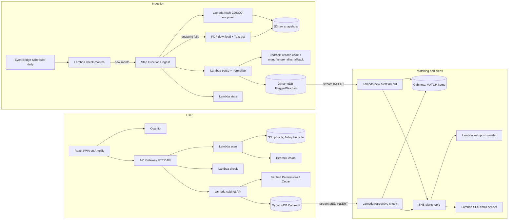

# ARCHITECTURE.md

## Overview

## Service choices and why
| Service | Why | Rejected alternative |
|---|---|---|
| EventBridge Scheduler | Daily cheap check; CDSCO publishes irregularly | Fixed monthly cron (misses late publishing) |
| Step Functions (Standard) | Retries, visible execution for the demo, Map state for backfill, Choice for PDF fallback | One large Lambda (timeouts, no visibility) |
| Lambda (Node.js 22) | Scales to zero; spiky, tiny workload | Containers (idle cost) |
| DynamoDB on-demand + Streams | Key lookups by batch; streams drive both matching directions without polling | RDS (idle cost, overkill) |
| S3 | Raw snapshots prove what CDSCO published and when; uploads with lifecycle | — |
| Textract (fallback only) | Only if the structured endpoint is unavailable | Primary path (costly, error-prone when a clean endpoint exists) |
| Bedrock (Claude, via Converse API) | Extract fields from strip/bill photos; classify unmapped failure reasons into a fixed enum at ingestion | LLM deciding matches (untrustworthy) |
| SNS | Fan-out to push and email; add channels by subscribing | Direct calls from matchers (coupling) |
| SES | Email alerts | SMS/WhatsApp (India DLT and Meta verification too slow for the weekend) |
| Web Push (VAPID) | Phone notification without an app store | Native app |
| Cognito | Managed sign-in, JWT for API Gateway | Custom auth |
| Amazon Verified Permissions | Managed Cedar; auditable caregiver policies | Ad-hoc role checks in code |
| Translate + Polly | Draft Hindi/Kannada templates (human reviewed); read-aloud | Runtime LLM translation of safety text |
| Amplify Hosting | PWA hosting with a URL in minutes | CloudFront + S3 by hand |
| CloudWatch (EMF metrics, dashboard) | Cost and accuracy evidence | Third-party APM |
| AWS CDK | Whole stack in one deploy, reviewable | Console clicking |

## Request flows
**Scan:** web → `POST /uploads` (presigned PUT) → upload to S3 → `POST /scans` → Bedrock extraction → `packages/matching` against FlaggedBatches → result (bill image deleted immediately).
**Manual check:** web → `POST /checks` → matching → result.
**Add medicine:** `POST /cabinets/{id}/medicines` → Cabinets MED item → stream → retroactive check → MATCH item → SNS → push + email.
**New CDSCO month:** Scheduler → check-months → Step Functions → FlaggedBatches inserts → stream → fan-out finds cabinet medicines by batch skeleton → matching → MATCH item → SNS → push + email.

## Deployment model
- `SharedStack-<stage>`: tables, buckets, SNS topic, Cognito, HTTP API + JWT authorizer, Verified Permissions policy store, idempotency table, SSM parameters. Owned by T02.
- `Lane<ID>Stack-<stage>`: one per lane, imports shared resources from SSM `/asli/<stage>/...`, adds its Lambdas, routes, subscriptions.
- Stages: `dev-<lane>` per lane, `int` for integration and demo.

## Region and quotas
All in `ap-south-1`. T01 verifies Bedrock model access (possibly via an APAC cross-region inference profile), Verified Permissions, Textract, Translate and Polly availability in this region, and SES sandbox status.
