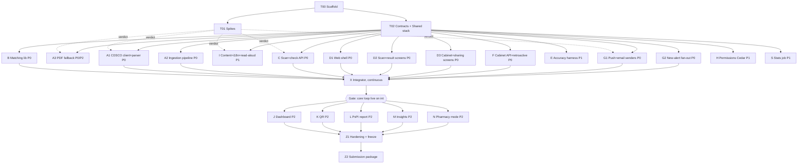

# BUILD_PLAN.md

## Event rules that shape this plan
- Project work starts **Thu 17 Sep 2026, 08:00 IST**. Planning docs may be prepared earlier, but the repository's **first commit happens after 08:00**. Commit these docs as the first commit.
- Submission deadline: **{{SUBMISSION_DEADLINE}}**. Submit a working version early and update it.
- The video is all judges see. Anything not shown does not count.

## How to run sessions
- One **lane = one Claude Code session = one task file** in `plan/tasks/`.
- Each lane works in its own git worktree and branch:
  `git worktree add ../asli-<ID> -b lane/<ID>` then start Claude Code in that folder with:
  > Read CLAUDE.md, then plan/tasks/<ID>-*.md, then the docs it lists. Do the task. Update the Handoff section before you stop.
- Each lane deploys its own stack with `STAGE=dev-<id>` and imports shared resources from `SHARED_STAGE=dev-shared` (deployed by T02).
- If a session runs out of context, start a new one with: "Continue plan/tasks/<ID>-*.md from its Handoff section."
- Recommended concurrency: 4–6 sessions. Start lanes in priority order.
- Lane X (integrator) merges lanes into `main` as they pass, deploys `int`, runs e2e tests.

## Priorities
- **P0** — required for the demo's core loop
- **P1** — strongly improves score; do after P0 lanes have started
- **P2** — extras; merge only if fully working

## Stages and lanes

| ID | Lane | Pri | Stage | Hard dependency | Can start against |
|---|---|---|---|---|---|
| T00 | Scaffold monorepo, CDK base, hello deploy | P0 | 0 | — | — |
| T01 | Spikes: CDSCO endpoint, push, SES, Bedrock, AVP, Polly | P0 | 0 | T00 | — |
| T02 | Contracts, fixtures, shared stack | P0 | 0 | T00 | T01 results for model ID (can use placeholder) |
| A1 | CDSCO endpoint client and parser | P0 | Wave 1 | T02, T01 verdict | Recorded responses |
| A2 | Ingestion state machine, backfill, new-month check, demo replay | P0 | Wave 1 | T02 | A1 interface (stub) |
| A3 | PDF + Textract fallback | P0 if endpoint fails, else P2 | Wave 1 | T02, T01 verdict | Sample PDFs |
| B | Matching library | P0 | Wave 1 | T02 | Fixtures |
| C | Upload, scan, check, alert detail APIs | P0 | Wave 1 | T02 | B stub, fixtures |
| D1 | Web shell: auth, layout, settings, push subscribe, i18n frame | P0 | Wave 1 | T02 | MSW mocks |
| D2 | Scan, confirm, result, bill results screens, manual entry | P0 | Wave 1 | T02 | MSW mocks |
| D3 | Cabinet, medicine detail, members, notification deep link | P0 | Wave 1 | T02 | MSW mocks |
| E | Accuracy harness and test set | P1 | Wave 1 | T02 | Local images |
| F | Cabinet API and retroactive check | P0 | Wave 1 | T02 | B stub, authz stub |
| G1 | Push + email senders, subscriptions API | P0 | Wave 1 | T02 | Sample AlertEvent |
| G2 | New-alert fan-out | P0 | Wave 1 | T02 | B stub, fixtures |
| H | Verified Permissions, invites, members API | P1 | Wave 1 | T02 | — |
| I | Content package, translations, read-aloud audio | P1 | Wave 1 | T02 | — |
| S | Stats job and public stats API | P1 | Wave 1 | T02 | Fixtures |
| X | Integrator: merge, deploy int, e2e, seed demo data | P0 | Continuous | Lanes as they finish | — |
| J | Cost and accuracy dashboard | P2 | Wave 2 | Core gate | — |
| K | QR decoding | P2 | Wave 2 | Core gate | — |
| L | PvPI report button | P2 | Wave 2 | Core gate | — |
| M | Public insights page | P2 | Wave 2 | S | — |
| N | Pharmacy mode | P2 | Wave 2 | Core gate | — |
| Z1 | Hardening, feature freeze | P0 | Stage 5 | — | — |
| Z2 | Submission package: README, writeup, video, blog | P0 | Stage 5 | Z1 | Starts drafting Saturday |

## Suggested start order (when you have fewer free sessions)
1. T00 → then T01 and T02 together
2. B, A1, C, D2 (the scan loop)
3. F, G1, G2, D1, D3 (the cabinet and alert loop)
4. A2, X
5. H, I, S, E (and A3 if the endpoint spike failed — then immediately, as P0)
6. Wave 2 in order: J, L, K, M, N

## Timeline (IST)
| When | Target |
|---|---|
| Thu 08:00–11:00 | T00, T01, T02 done. Hello app on Amplify URL. Endpoint verdict known. SES production access requested. Contracts frozen. |
| Thu 11:00–late | Wave 1 P0 lanes running; test set collection starts |
| Fri midday | B, A1, C, D2 merged → scan loop works on `int` |
| Fri evening | **Core gate:** F, G1, G2, A2, D1, D3 merged → full core loop on `int`, real Android phone |
| Sat morning | P1 lanes merged (H, I, S, E). Record a rough demo draft. |
| Sat afternoon | Wave 2 extras; each merged only if fully working |
| Sat 18:00 | **Early submission** of a working version |
| Sat 22:00 | **Feature freeze** (Z1) |
| Sun | Bug fixes, real phone testing, final video, writeup, blog, resubmit |
| {{SUBMISSION_DEADLINE}} minus 3 hours | Final submission |

## Gates
- **Stage 0 gate:** app deployed; spikes documented in `plan/tasks/T01-spikes.md` Handoff; contracts package builds and fixtures validate.
- **Scan gate:** a real strip photo on the `int` URL returns a correct result card.
- **Core gate:** add medicine → retroactive match → push + email; demo replay → push + email; on a real Android phone.
- **Freeze gate:** no open P0 bugs; e2e green on `int`; video recordable end to end.

## Cutting rules if behind
1. Drop Wave 2 entirely before touching any P0 lane.
2. Drop H (use authz stub, show sharing without the Cedar moment) before I.
3. Drop Kannada audio before Hindi text.
4. Never cut: source links, "No alert found" wording, the demo replay, the video.
